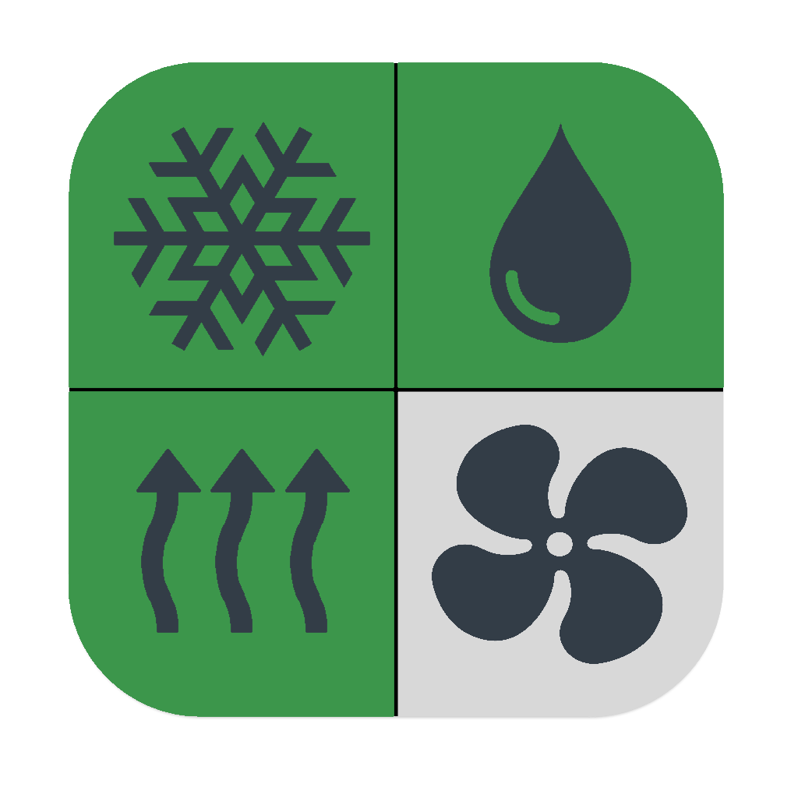

# Moderon HVAC project
  

This program is used to configure Moderon controllers through the selection of ventilation equipment and related settings.

There are options for the user to choose from:

- filters
- flaps
- heater
- auxiliary heater
- cooler
- humidifier
- recirculation
- recuperator
- backup fan

The command words and signal table for the controller are generated. The settings can then be downloaded via COM port.

